# 工业蒸汽量预测

[toc]

## 二、数据探索

### 1. 理论知识

#### 1.1 变量识别

- 识别输入变量/特征(predictor)与输出变量/标签(target)
- 识别数据类型及判断时连续型变量还是类别型变量

>- 连续型数据：在一定区间内可以任意取值的变量叫连续变量，其数值是连续不断的。例如，生产零件的规格尺寸，人体测量的身高、体重等。可视化这类数据的图表主要有箱形图和直方图。
>- 离散型数据：数值只能用自然数或整数单位计算的则为离散变量。例如，企业个数，职工人数，设备台数等，只能按计量单位数计数。大多数图表可视化的都是这类数据，比如柱状图、折线图等。

#### 1.2 变量分析

- **单变量分析**
  - 对于**连续型变量**，需统计数据的中心分布趋势(central tendency)和变量的分布(dispersion)
    - 中心分布趋势:平均值$mean$，中位数$median$，众数$mode$，最小值$min$，最大值$max$
    - 变量分布:区间$range$，四分位数$quartile$，四分位间距$IQR$(3/4处减去1/4处)，方差$variance$，标准差$standard deviation$，峰态$kurtosis$
  - 对于**类别型变量**，使用频次或频率(占比)表示每类的分布情况

- **双变量分析**
  - **连续型与连续型**
    - 绘制**散点图**：反映变量之间的关系是线性还是非线性
    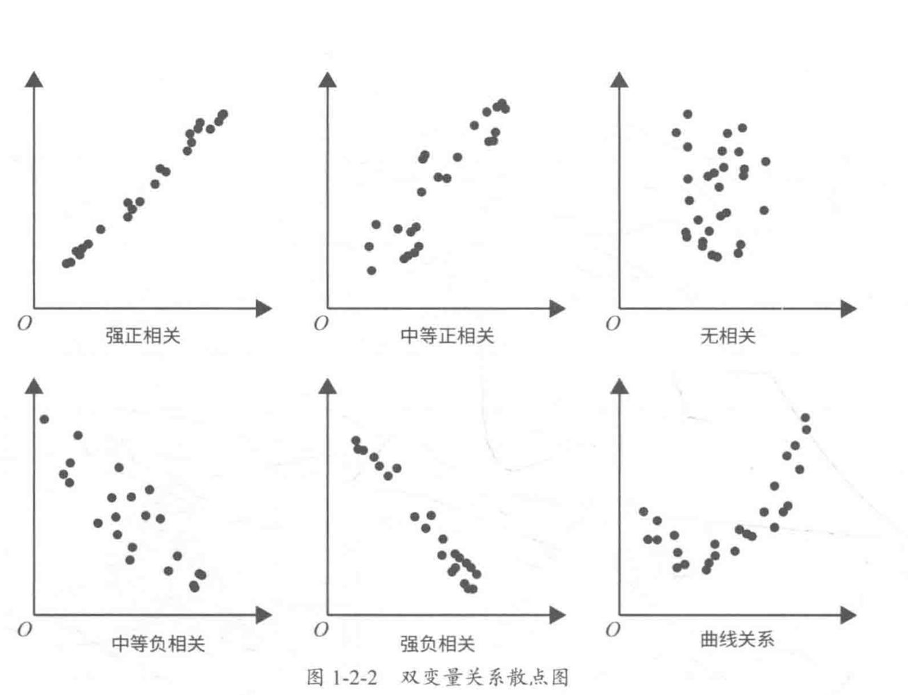  
    - 计算**相关性**：散点图只能直观反映双变量的关系，但不能说明关系的强弱，可通过相关性系数对变量之间的关系进行量化分析。
   $$Correlation = \frac{Covariance(X,Y)}{\sqrt{Var(X)*Var(Y)}}$$
      - `np.corrcoef(X, Y)`;相关性系数=-1时，表示强负线性相关，=1表示强正线性相关，=0表示不相关;一般来说$0-0.09$为没有相关性，$0.1-0.3$位弱相关，$0.3-0.5$为中等相关，$0.5-1.0$为强相关。
  - **类别型与类别型**
    - 双向表
    - 堆叠柱状图
    - 卡方检验：统计样本的实际观测值与理论推断值之间的偏离程度，卡方值越大，二者偏离程度越大。

      ```python
      import numpy as np
      from sklearn.datasets import load_iris
      # 选择出前k个与标签最相关的特征
      from sklearn.feature_selection import SelectKBest 
      from sklearn.feature_selection import chi2 # 卡方检验
      iris = load_iris()
      X, y = iris.data, iris.target
      chiValues = chi2(X, y)
      X_new = SelectKBest(chi2,k=2).fit_transform(X, y)
      # selectKbest选出前k个与标签y最相关的特征 fit_transform还不懂
      ```

  - **类别型与连续型**
    - 小提琴图$violin\ plot$：分析类变变量在不同类别时，另一个连续变量的分布情况。

#### 1.3 缺失值处理

缺失值处理办法

- **删除**
  - 成列删除，即删去该样本，简单，但你和能力降低
  - 成对删除，即删除对应的缺失值，保留更多的样本数，不同特征使用大小不同的样本
- **平均值、众数、中值填充**（最常用）
- **预测模型填充**
  - 通过建立预测模型天不缺失值，将训练集分为两份，没有缺失值的那份作为训练集，有缺失值的作为测试集，那么模型预测目标即为缺失值。

#### 1.4 异常值处理

异常值：远远偏离整个样本总体的观测值。
可能产生的原因：数据输入误差、测量误差、实验误差、人为有意异常值、数据处理误差、采样误差等。

##### 检测异常值

- 可视化方法
  - 箱线图（不在$-1.5IQR-1.5IQR$之间的样本点(即在上下边缘之外)被认为是异常值）、直方图、散点图

##### 处理方法

- 删除
- 转换：如取对数会减轻由极值引起的变化
- 使用平均值、中值等填充
- 区别对待：若存在大量异常值，则异常值分一组，非异常值分一组

#### 1.5 变量转换

当某变量的取值分布不平均是，需对变量的取值空间进行转换，使其分布落在合理的空间内。
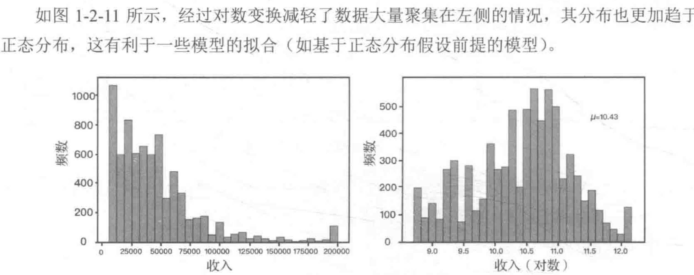  

变量转换的方法：

- 缩放比例或标准化：因为数据具有不同的缩放比例，不会更改变量的分布。
- 非线性转换为线性：线性关系更易理解，常用对数变换
- 使倾斜分布对称：取平方根和立方根或对数指数等
- 变量分组

#### 1.6 新变量生成

基于现有变量生成新变量，可能新变量与目标变量有更好的相关性。如将Date(dd-mm-yy)拆分成年、月、日、周等。
方法：

- 创建派生变量
- 创建哑变量：将类别型变量转换为数值型变量；如将Gender变为isMale和isFemale两个数值型(0,1)。

#### 1.7 各种图

直方图($histogram$)：表示数据的分布情况的图表；横轴表示数据样本，纵轴表示数据分布情况；
Q-Q图：对比参照数据的分位数和正态分布的分位数的图，如果数据符合正态分布，则所有的店都落在直线上；

### 2. 赛题数据探索实操

1. 导入工具包
   1. `numpy,pandas,matplotlib,seaborn`
2. 读取数据
   1. `pd.read_csv()`
3. 查看数据
   1. `df.info(), df.describe(), df.head()`
4. 可视化数据分布
   1. 箱形图`sns.boxplot()`观察一下异常值
   2. 获取异常数据并画图
   3. 直方图和Q-Q图`sns.distplot(), stats.probplot()`观察一下分布是否近似与正态分布
   4. KDE分布图(核密度估计)`sns.kdeplot()` KDE是直方图的加窗平滑；用以对比训练集和测试集中特征变量的分布情况，发现不一致的特征变量。
   5. 线性回归关系图`sns.regplot()`观察特征变量与target变量之间的线性回归关系
5. 查看特征变量的相关性
   1. 计算相关性系数`df.corr()`
   2. 画相关性热力图`sns.heatmap()`
   3. 依据相关性系数筛选特征变量
   4. Box-Cox变换

## 三、特征工程

### 1. 特征工程的重要性和处理

> 数据和特征决定了机器学习的上限，而模型和算法知识逼近这个上限而已
> 具体而言，特征越好、灵活性越强、构建的模型越简单、性能越出色
特征工程的流程：去掉无用特征->去掉冗余特征(eg 共线特征)->生成新特征->特征转换(数值化、类别转换、归一化)->特征处理

### 2. 数据预处理和特征处理

#### 2.1 数据预处理

1. 数据采集
2. 数据清洗（取出脏数据，比如某些商品的刷单数据）
   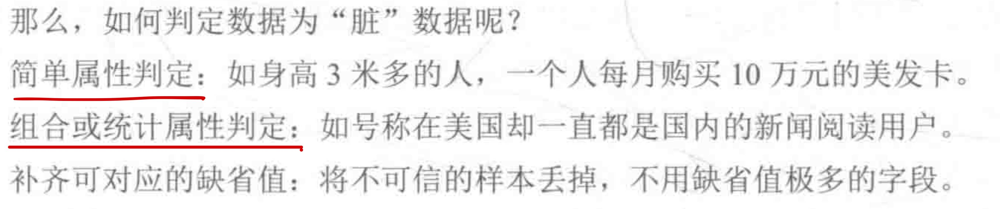  
    比如规定范围之外的样本值。
3. 数据采样
   1. 当正负样本不均衡时，可采取随机采样或分层采样。使正负样本均匀。
   2. 当正样本>负样本，且量都特别大，采用下采样(downsampling)(缩小图像)
   3. 当正样本<负样本，且量不大，上采样(oversampling)(放大图像)

#### 2.2 特征处理

- **==标准化==**$(Standardization)$
  - 将数据变换为均值为0，标准差为1的分布切记，并非一定是正态的；
  $$
  x' = \frac{x-\overline{X}}{S}
  $$

  ```python
  from sklearn.preprocessing import StandardScaler
  StandardScaler().fit_transform(iris.data)
  ```

- **区间缩放法**
  - 常见的是利用最值进行缩放到[0,1]
$$
x' = \frac{x-x_{min}}{x_{max}-x_{min}}
$$

```python
from sklearn.preprocessing import MinMaxScaler
MinMaxScaler().fit_transform(iris.data)
```

- **==归一化==**$(Normalization)$
  - 将样本的特征值转换到同一量纲/区间下，把数据映射到[0,1] 或 [a,b] 区间内，**由于其仅由变量的极值决定，因此区间缩放法是归一化的一种。**
  - **归一化的好处：加快梯度下降求解最优解的速度；**
  - **归一区间会改变数据的原始距离、分布和信息，但标准化一般不会。**
  - 规则为L2的归一化公式如下
$$
x' = \frac{x}{\sqrt{\sum_j^m x_j^2}}
$$

```python
from sklearn.preprocessing import Normalizer
Normalizer().fit_transform(iris.data)
```

- 归一化与标准化的使用场景：
  - 如果对**输出结果范围有要求**，则用归一化
  - 如果**数据较为稳定，不存在极端最值**，则用归一化（因其取决于变量的极值）
  - 如果**数据存在异常值或较多噪声**，则用标准化，如此可通过中心化间接避免异常值和极端值的影响
  - SVM、KNN、PCA等模型必须进行归一化或标准化

- **定量特征二值化**
$$
x'=\left\{
\begin{aligned}
1,x>threshold; \\
0,x\leq threshold; \\
\end{aligned}
\right.
$$

```python
from sklearn.preprocessing import Binarizer
Binarizer().fit_transform(iris.data)
```

- **定性特征哑编码**
  - 将多分类变量转换为哑变量（Dummy Variable）
  - eg 男0女1

- **缺失值处理**
  - pandas将缺失值表示为NaN
`SimpleImputer().fit_transform()`

- **数据转换**
  - 多项式转换
  - 对数转换

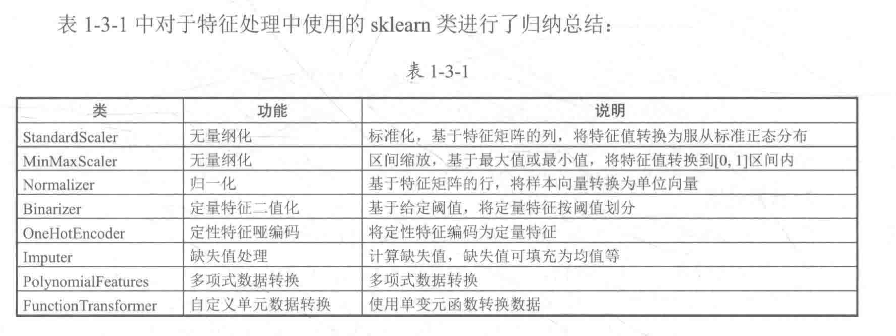  

### 3. 特征降维

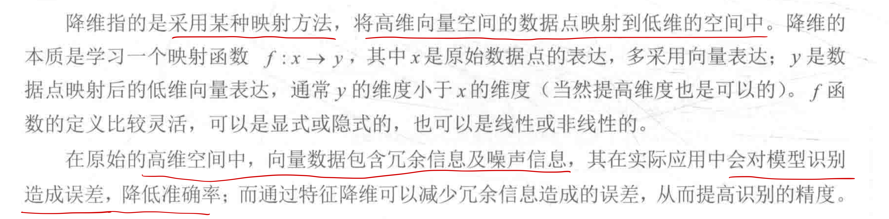  
  特征降维的常用方法为**特征选择**和**线性降维**

#### 3.1 特征选择

简单粗暴，映射函数直接将不重要的特征删除，但会丢失特征信息。
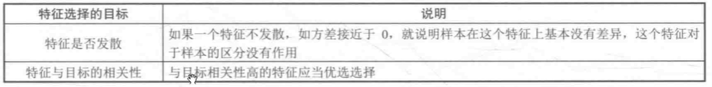  

- **特征选择方法：**
  - 过滤法Filter
    - VarianceThreshold
 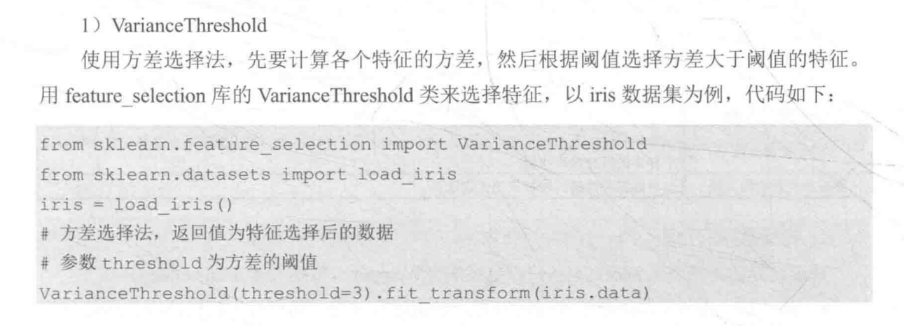  
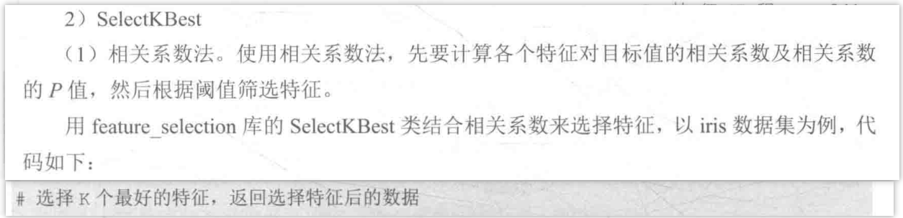  
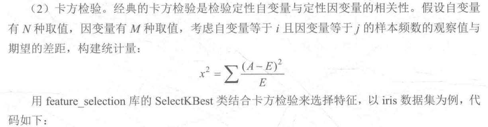  

  - 包装法Wrapper
  - 嵌入法Embedded

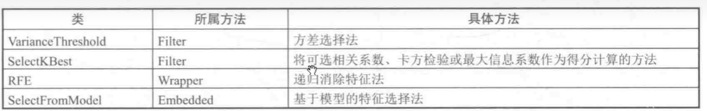  

#### 3.2 线性降维

- **主成分分析法PCA**（无监督）
  - 通过某种线性投影，将高维数据映射到低维空间，并期望在所投影的维度上数据的**方差最大**，以此达到使用较少的数据维度来保留较多的原数据点特性的效果。

```python
from sklearn.decomposition import PCA
PCA(n_components=2).fit_transform(iris.data) #n_components为主成分的数目
```

- **线性判别分析法LDA**（有监督）
  - 与PCA尽可能多地保留数据信息不同，LDA的目标是使降维后的数据点尽可能地容易被区分。“**投影后类内的方差尽可能小，类间方差尽可能大**”

```python
from sklearn.discriminant_analysis import LinearDiscriminantAnalysis as LDA
LDA(n_components=2).fit_transform(iris.data) #n_components为降维后的维数
```

### 4. 赛题特征选择

1. 异常值分析`plt.boxplot()`
2. 最大值和最小值的归一化`MinMaxScaler().fit_transform()`
3. 查看数据分布`sns.kdeplot()`
4. 特征相关性`df.corr()`
5. 特征降维（筛选出corr>0.1的特征变量）
6. 多重共线性分析
7. PCA处理

## 四. 模型训练

### 1. 回归及相关模型

#### 1.1 回归模型训练和预测步骤

1. 导入工具库
2. 数据预处理：include 导入数据集、处理数据等操作，具体为缺失值处理、连续特征归一化、类别特征转换等。
3. 训练模型：选择合适的model，利用训练集对model训练。
4. 预测结果：将待预测数据集输入到训练好的model。

#### 1.2 线性回归模型

Y与X呈线性相关
损失函数：$MSE$

- 一元线性回归模型
  - 单一特征自变量X估计y
  - 通过最小化代价函数得到
- 多元线性回归模型
  - 多个特征自变量X估计y

- 优点：模型简单、部署方便；训练快
- 缺点：精度低，特征存在一定的共线性问题
- 技巧：特征需归一化，建议进行一定的特征选择，尽量避免高度相关的特征同时存在。

#### 1.3 K近邻回归模型

KNN算法可用于分类和回归。回归中：找k个最近邻居，将这些邻居的某个属性的平均值赋给该样本，就找到了该样本对应属性的值。
损失函数：$MSE$

- 优点：模型简单、可快速处理数据量小的情况
- 缺点：计算量大，不适合数据量大的情况；需要调参；
- 技巧：特征需归一化，重要的特征需适当加一定比例的权重

#### 1.4 决策树回归模型

根据一定准则，将一个空间划分为若干个子空间，然后利用子空间内所有点的信息表示这个子空间的值；
如何回归预测? 利用这些**划分区域的均值或中位数**代表这个区域代表这个区域的预测值
损失函数：

$$
L(D) = \sum_{i=1}^k(y_i - \overline{y_1})^2 + \sum_{i=k+1}^N(y_i - \overline{y_2})^2
$$

遍历所有点求出L(D),找到最优分割点D；然后在D左和D右继续上述步骤，直到满足停止条件。

#### 1.5 集成学习回归模型

1. **随机森林回归模型**
   1. 通过集成学习的思想将多棵树集成的一种算法，基本单元是决策树；其本质属于机器学习的一个分支——集成学习$Ensemble\ Learning$
   2. 回归中，随机森林输出所有决策树输出的平均值
   3. 优点：
      1. 精度较高
      2. 能有效运行在大数据集上；
      3. 能够处理具有高维特征的输入样本，无需降维；
      4. 能评估各特征在分类问题上的重要性；等
   4. 缺点：结果不容易解释
   5. 技巧：参数调节，提高精度
2. **LightGBM回归模型**
   1. $Light Gradient Boosting Machine$是Microsoft开发的一个$GBDT(Gradient Boosting Decision Tree)$算法框架，具有更快的训练速度、更低的内存消耗、更好的准确率、分布式支持、可以快速处理海量数据等特征；
   2. 优点：精度高
   3. 缺点：慢，模型复杂
   4. 技巧：有效的验证集防止过拟合；参数搜索

#### 模型预测改善流程

1. 原始的train_data 分割为 train和target，再split为train和test
   1. LinearRegression_MSE:           0.116
   2. LinearRegression_R2_score:      0.889
   3. KNeighborsRegressor_MSE:        0.218
   4. KNeighborsRegressor_R2_score:   0.790
   5. DecisionTreeRegressor_MSE:      0.238
   6. DecisionTreeRegressor_R2_score: 0.771
   7. RandomForestRegressor_MSE:      0.132
   8. RandomForestRegressor_R2_score: 0.873
   9. lightGbm_MSE:                   0.114
   10. lightGbm_R2_score:             0.891
2. 将特征V9的两个异常值去掉(**MSE基本在下降，同时准确率基本在上升**)
   1. LinearRegression_MSE:  0.102
   2. LinearRegression_R2_score:  0.908
   3. KNeighborsRegressor_MSE:  0.214
   4. KNeighborsRegressor_R2_score:  0.806
   5. DecisionTreeRegressor_MSE:  0.263
   6. DecisionTreeRegressor_R2_score:  0.761
   7. RandomForestRegressor_MSE:  0.120
   8. RandomForestRegressor_R2_score:  0.891
   9. lightGbm_MSE:  0.101
   10. lightGbm_R2_score:  0.908
3. 将特征**归一化**之后$min_max_scaler$（**为何模型归一化后MSE上升，准确率下降？**）
   1. LinearRegression_MSE:  0.241
   2. LinearRegression_R2_score:  0.765
   3. KNeighborsRegressor_MSE:  0.268
   4. KNeighborsRegressor_R2_score:  0.739
   5. DecisionTreeRegressor_MSE:  0.530
   6. DecisionTreeRegressor_R2_score:  0.483
   7. RandomForestRegressor_MSE:  0.228
   8. RandomForestRegressor_R2_score:  0.777
   9. lightGbm_MSE:  0.201
   10. lightGbm_R2_score:  0.804
4. PCA处理选择16个特征(**为啥又tm降低了**)
   1. LinearRegression_MSE:  0.272
   2. LinearRegression_R2_score:  0.735
   3. KNeighborsRegressor_MSE:  0.268
   4. KNeighborsRegressor_R2_score:  0.739
   5. DecisionTreeRegressor_MSE:  0.588
   6. DecisionTreeRegressor_R2_score:  0.427
   7. RandomForestRegressor_MSE:  0.249
   8. RandomForestRegressor_R2_score:  0.758
   9. lightGbm_MSE:  0.244
   10. lightGbm_R2_score:  0.762

> PCA降维的目的是防止维度灾难，PCA是为了挑选出权重高的特征

## 五、模型验证

### 1. 模型评估的概念与方法

#### 1.1 欠拟合与过拟合

欠拟合$(underfitting)$又名高偏差$bias$
可通过增加额外的特征、增加多项式特征、减小$\lambda$的值等方法优化模型。
过拟合$(overfitting)$又名高方差$variance$
可通过手机更多的数据、使用更少的特征、增加$\lambda$的值等方法优化模型。

> 示例：在多项式回归中，degree越大/多项式次数，模型均方误差越小，拟合的效果越好；总能找到一条曲线将所有的样本点拟合，使得整体的均方误差为0；但在预测未知数据时，泛化能力降低，预测偏差增大。

#### 1.2 模型泛化与正则化

泛化$Generalization$：即模型处理新样本的能力
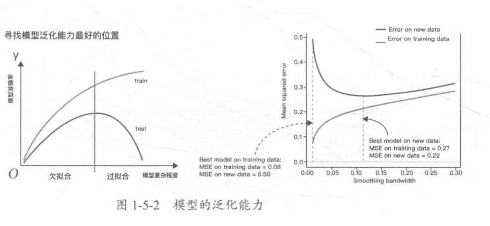  
正则化$Regularization$：给需要训练的目标函数加上一些规则（限制），目的是为了防止过拟合。

岭回归$Ridge Regression$：对参数空间进行L2范数正则化的线性模型
$LASSO$回归：对参数空间进行L1范数正则化的线性模型

#### 1.3 回归模型的评估指标

平均绝对值误差$MAE$：$mean\_absolute\_error$:预测值与真实值之差的绝对值。
$$
MAE = \frac{1}{n} \sum_{i=1}^n |y_i - y_i|
$$

均方误差$MSE$：$mean\_square\_error$
$$
MSE = \frac{1}{n} \sum_{i=1}^n (f_i - y_i)^2
$$

均方根误差$RMSE$：$root\_mean_square_error$
$$
RMSE = \sqrt{MSE}
$$

$R$平均值：$r2\_score$：反映模型对观测值的拟合程度。
  

#### 1.4 交叉验证

检查验证$Cross Validation$是验证分类器性能的一种统计分析方法。常用的交叉验证方法包括简单交叉验证、K折交叉验证、留一法交叉验证和留P法交叉验证。

##### 简单交叉验证

将原始数据随机分为两组，训练集和验证集。
这个测试集和交叉验证集一样了？？书本何时会讲？

```python
from sklearn.model_selection import train_test_split
X_trian, X_test, y_train, y_test = train_test_split(iris.data, iris.target, test_size=4, random_state=0)
```

##### K折交叉验证

$K-Fold\ Cross\ Validation$将原始数据均分为K组，然后将每个子集数据分别做一次验证集，其余K-1组子集数据作为训练集，这样会训练出K个模型。将K个模型最终的验证集的分类准确率取平均值作为其性能指标。

```python
from sklearn.model_selection import KFold
kf = KFold(n_splits=10)
```

##### 留一法交叉验证

$LOO-CV\ Leave-One-Out\ Cross\ Validation$留训练集中的一个样本作为检验集，其余N-1个作为训练集。可得到N个模型，最后取N个准确率的平均数。
**样本利用率最高，适合小样本。**

##### 留P法交叉验证

$LPO-CV$

### 2. 模型调参

#### 2.1 调参

调参的目的是达到整体模型的偏差和方差的大和谐，找到使模型性能最优的参数。参数分为：过程影响类参数、子模型影响类参数。

- 过程影响类参数：在子模型不变的前提下，调整“子模型数$n\_estimators$”“学习率$learning\_rate$”等参数，改变训练过程，从而提高整体模型的性能。
- 子模型影响类参数：调整“最大树深度$max_depth$”“分裂条件$criterion$”等参数，改编自模型的性能，从而提高整体模型的性能。

#### 2.2 网格搜索

网格搜索$Grid Search$是一种穷举搜索的调参手段。循环遍历所有候选参数。
形似网格
  
